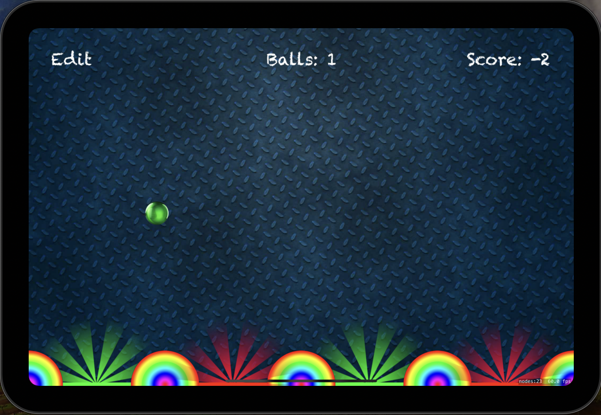
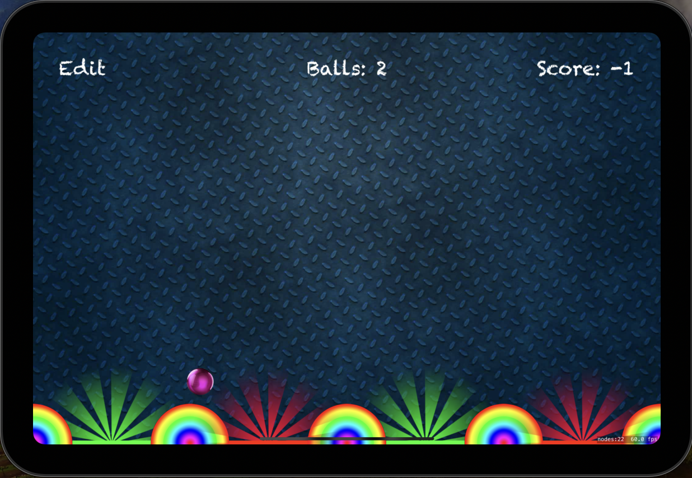

# Project11 Pachinko

This is a SpriteKit-based game where the player can create and manipulate balls, boxes, and slots. The goal of the game is to score points by dropping balls onto good slots, while avoiding bad slots.

## Features

* Create and manipulate balls with different colors
* Create and manipulate boxes
* Create and manipulate slots (good and bad)
* Score points by dropping balls onto good slots
* Avoid dropping balls onto bad slots

## Screenshots

  

  

## Game Rules

* The game starts with 5 balls
* The player can create new balls by tapping on the screen
* The player can move the camera to view different parts of the game scene
* Good slots award points when a ball is dropped onto them, while bad slots deduct points
* Boxes do not affect the game score

## Controls

* Tap on the screen to create new balls
* Swipe left or right to move the camera
* Double tap on the screen to toggle editing mode

## Technical Requirements

* iOS 12.0+
* Xcode 12.0+
* Swift 5.0+

## Future Development

* Implement animations for ball creation and destruction
* Add sound effects for ball creation and destruction
* Add more types of slots (e.g. special power-up slots)
* Implement game over screen and restart functionality
